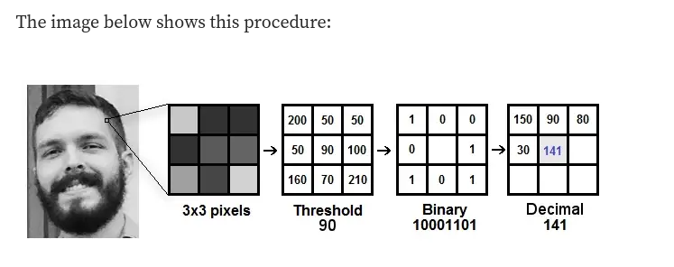
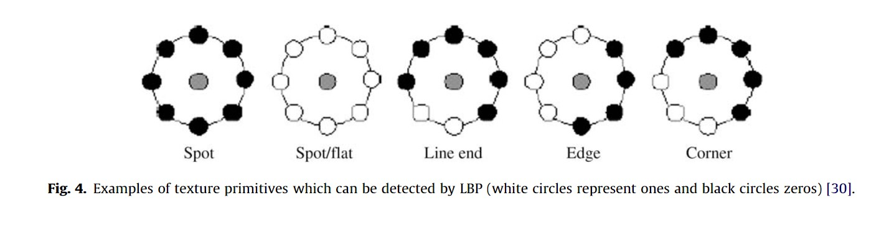
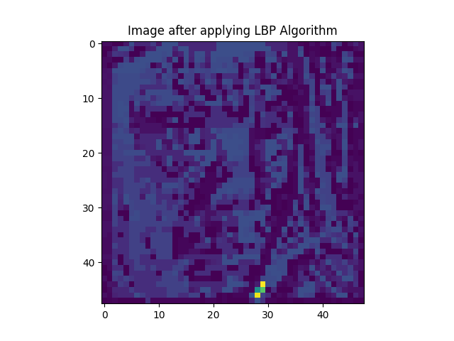

# Local Binary Pattern Histogram:

Local Binary Pattern (LBP) is a simple yet very efficient texture operator which labels the pixels of an image by thresholding the neighborhood of each pixel and considers the result as a binary number.

# Procedure:

# Now we explain How ULBPH captures facial data.

1. Edges in images are high chage in pixel values in one direction relative to the current pixel.

2. Below diagram explains how LBP captures textures of data.

3. Black circle represents low value pixel (~0).

4. White circle represents high value pixel (~250).

# Image before LBPH filter

# Result after LBPH filter

